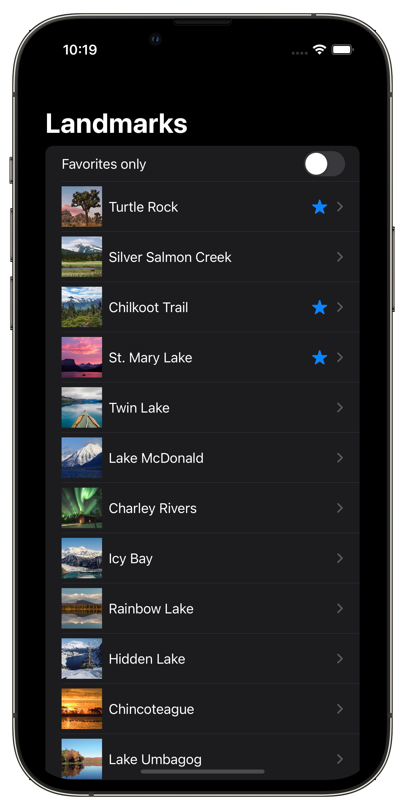
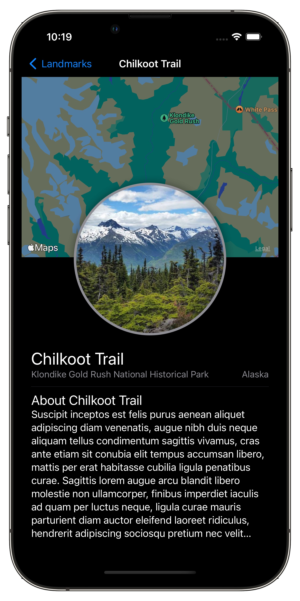

# Landmarks

## 🌲 About

This is an introductory project on the workings of SwiftUI. The link to the original project is: https://developer.apple.com/tutorials/swiftui/creating-and-combining-views. This application is titled "Landmarks". In the app, you can view some of the beautiful landmarks located in the United States.

  
  

